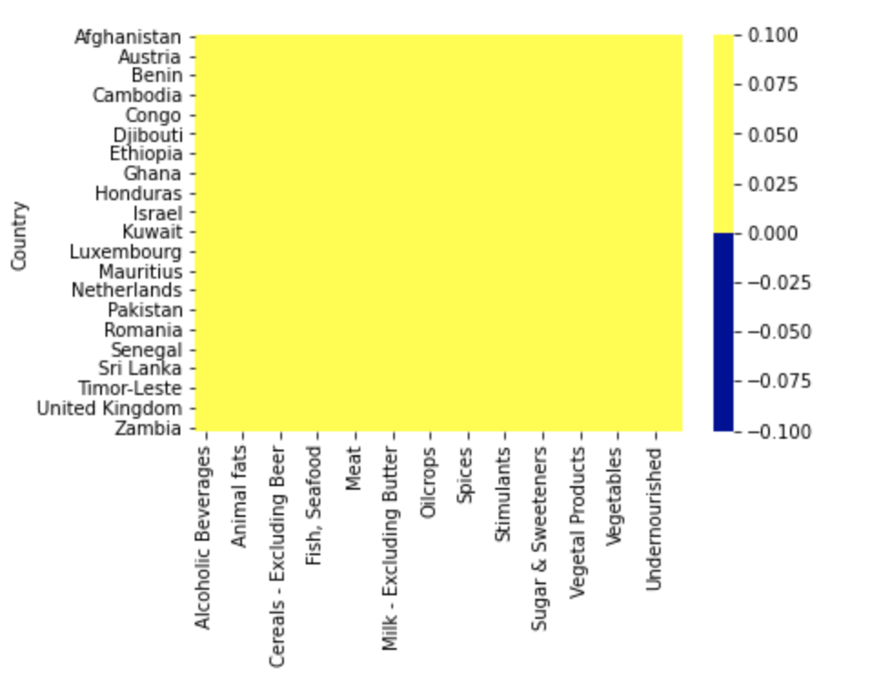
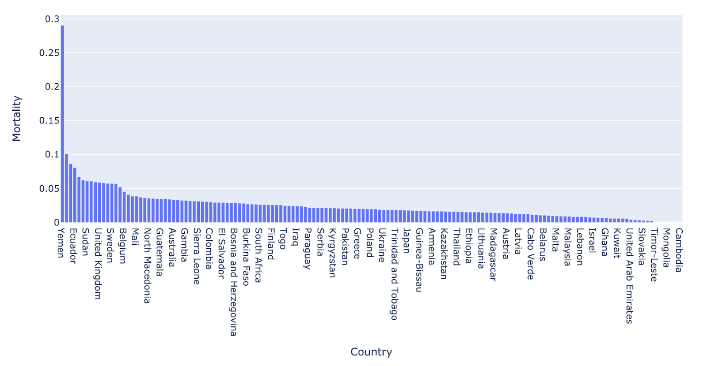

# Predicting Nutrition and Immunity Scores Using a CNN Model

## Summary

Description: This image depicts the finalized goal, which is to output nutrition, healthy, and immunity score information from an inputted image.

**Project Summary**

The outcome of this project would be a better understanding of what constitutes an ideal nutrition intake to stay healthy during the COVID-19 pandemic. Given a food image, the model will give nutrition information about the food. It will also give the user an immunity score and a health score. This will serve as a guideline on how a user could improve and monitor their diet in order to increase their immunity against COVID-19.

From studying the nutrition intake of countries around the world and their respective COVID-19 stats (affected, deaths, recoveries) we hope to predict from a person&#39;s diet whether they have covid/chances of getting covid. Our team is aware that nutrition is not the only feature which affects the chances of getting or fighting COVID-19. We are hoping that on the larger scale, the other features are neutralized and averaged out. If our team finds evidence that they are not, we will manipulate our data and use some sort of Unsupervised Learning Technique to divide our data set into various clusters which will be analyzed separately.

## Introduction and Background

With Covid-19 posing a worldwide health risk and impacting so many people’s lives, it is essential to use every tool at our disposal to help fight against this disease. One likely important factor in immune response to the virus is nutritional status. In fact, increasing evidence is showing that poor nutritional profiles, and factors like obesity and lack of exercise are correlated with poorer outcomes when confronted with the virus (Belanger). This may be a contributor to poorer outcomes among minorities and lower-income populations with less access to nutritionally dense food. 

## Methods

**Dataset 1 Exploration**

COVID Healthy Diet dataset - [https://www.kaggle.com/mariaren/covid19-healthy-diet-dataset/notebooks?sortBy=hotness&amp;group=everyone&amp;pageSize=20&amp;datasetId=618335](https://www.kaggle.com/mariaren/covid19-healthy-diet-dataset/notebooks?sortBy=hotness&amp;group=everyone&amp;pageSize=20&amp;datasetId=618335)

This dataset has fat quantity, energy intake (kcal), food supply quantity (kg), and protein for different categories of food (all calculated as percentage of total intake amount). It also has data on the obesity and undernourished rate (also in percentage) for comparison. The end of the datasets also included the most up to date confirmed/deaths/recovered/active cases (also in percentage of current population for each country).

Different food group supply quantities, nutrition values, obesity, and undernourished percentages are obtained from Food and Agriculture Organization of the United Nations FAO website.

**Step 1: Data Cleaning**

**Cleaning Dataset 1 with Normalization:** Removing unnecessary columns and data normalization and scaling -

- The datasets had a column that contains information about the unit of rest of the columns. So we could just remove this column and use the information it provided.

- The &#39;Population&#39; feature had values in the range 10^4 to 10^9. This could potentially introduce a bias in the model. So we did a MinMax scaling on the feature.

Before scaling -

After scaling -

**Dealing with Null Values in Dataset 1 :** Dealing with data types and missing values -

- The &#39;Undernourished&#39; feature had percentage values in String data type. For values that were below 2.5% the dataset denotes &#39;&lt;2.5&#39;. We converted all the string values to numeric data type and changed &#39;&lt;2.5&#39; to 2 as a crude way to handle the issue.

- To check for missing values in the dataset, we plotted a heatmap.

- As we can see, there are quite a few missing values. Although there are some datapoints with missing labels. We removed these rows first, since we won&#39;t be able to use the datapoints that do not have label values.
- Then, we used K-Nearest Neighbours algorithm to impute missing values and got a heatmap with no missing values - 

**Step 2: Data Visualizations**

To see the correlation between features in the datasets, we calculated the Correlation matrix and generated the plots.

Fat intake dataset Correlation Matrix

Food supply in kCal dataset -

Protein intake dataset -

Food Supply Quantity kg dataset -

Our dataset provided country-wide information for the consumption and supply (in kg and kcal) of various food items, as well as statistics for the confirmed, recovered, and active cases, and deaths due to COVID-19 for each country in the study. For each piece of information we created visualizations of their correlation matrices above. Although each correlation matrix depicts a different type of measurement for each food item in a country, they are all similarly correlated. This means that the relationships between the food items are similar between the different measurements in the dataset. For this reason we have chosen to do our discussion on the Fat intake dataset Correlation Matrix.

This correlation matrix provides useful insight into both the intra-relationship between the dietary intake of different food items of people in a country as well as the relationship between the dietary intake and the statistics of each country in the COVID-19 pandemic. For instance, we can see the relatively high positive correlation of obesity with the consumption of animal products and animal fats, depicting the intra-relationship of three features. We can further note that obesity is relatively highly correlated with the country statistics for confirmed, recovered, and active cases, depicting the relationship between the dietary intake and some country-wide statistics of the COVID-19 pandemic. Therefore, the correlation matrix above gives us an idea of where our model may be drawing information from and how each feature may influence its predictions.

**Step 3: Unsupervised Learning**

We ran a k-Means clustering on our dataset to see if there are any clusters. We plotted the elbow curve for the loss score of the k-Means algorithm. We ran for a number of clusters upto 20.

We did not get any conclusive results from the elbow function for the optimal number of clusters for the datasets.

Hence, it seems that there are no clusters forming in the dataset. Below figure shows the elbow plot for one of the datasets -

**Step 4: Dimensionality Reduction**

We ran Principal Component Analysis on the dataset.

99% cumulative expected variance - 22 components

Protein intake dataset -

Food supply in kCal dataset -

Fat intake dataset -

Food supply in kg dataset -

**Dataset 2 Exploration**

[Individual Health data with dietary information CDC](https://www.kaggle.com/cdc/national-health-and-nutrition-examination-survey?select=diet.csv)

This dataset contains a large amount of information collected as part of a study by the CDC to assess the health of the American population. This dataset includes a variety of data, including a breakdown of the dietary intake of the subjects in the study, as well as a thorough assessment of their health, collecting information such as their body mass index and blood pressure. This dataset will be useful for us to make predictions of a person&#39;s health based on their dietary information.

Plot 1- Correlation Matrix for Nutrition information

Plot 1 Discussion-

This correlation matrix provided us a lot of useful information that helped inform further exploration of the data. Furthermore, we noticed patterns of correlation such as certain nutritional aspects, like different types of fats (monounsaturated, polysaturated, etc) tending to correlate but things like carotene finding no correlation with other nutritional pieces. This will help us further breakdown our nutritional information into food groups and clusters rather than analyzing them piece by piece. Furthermore, joining highly positively correlated nutritional information into food groups will help us link this dataset to our other datasets, which do not give such granularity of nutritional intake.

Plot 2- Correlation for Participant Examination Information

Plot 2 Discussion- This correlation matrix shows the correlation between four features in our dataset: BPXSY1 (blood pressure reading 1), BPXSY2 (blood pressure reading 2), BPXSY3 (blood pressure reading 3), and BMXBMI (the body mass index [BMI] of a person in the dataset). We wanted to see how well blood pressure correlated with BMI, both of the signals which will help us determine the health of a person. We found that the three blood pressure readings were highly correlated, indicating that we could only use one in our evaluation of a person&#39;s health. Furthermore, we found that the BMI of a person was not highly correlated with the blood pressure reading, which means that when evaluating the health of an individual only taking into account the blood pressure readings will not be enough, both pieces of information will be necessary.

**Plot 3 - Nutritional Information Data projected to the first two principal components and its associated Scree Plot**

 

We can see that the data projected to vector space of the two principal components aggregates around a specific cluster resembling a tilted triangle. This may indicate that the nutritional diets of the people in the study are very similar to each other. Furthermore, as seen in the scree plot, the first and second principal components in the scree plot do not capture more than half of the variance in the dataset, indicating that we will need to use many more principal components to see more variance in their diets.

**Plot 4 - Examination Data projected to the first two principal components and its associated Scree Plot**

 

The examination information of the people in the dataset (only including blood pressure and BMI features) projected to its first principal components shows a similar structure to the one in plot 3, where the data is clustered in a shape resembling a triangle. This could show that the linear projections of the data for both types of information in our dataset to their respective principal components are very similar. Furthermore, the explained variance in the first two principal components for this type of information is very high, indicating that we could use less dimensions while retaining a large percentage of the information contained in the dataset.

**Plot 5 - Nutritional Information Data projected to the first two principal components with color depicting data point&#39;s BMI rating**

In this plot we color each of the data points in the projection for the Nutritional Information Data to the first two components with its associated BMI rating of being overweight (blue), normal weight (green), or underweight (red). Here we can see that the majority of the people in the study are overweight according to their recorded BMI&#39;s, but we also see that in the first two principal components, the people who are overweight, underweight, and normal weight cannot be linearly separated. This gives us some intuition to the complexity that our model for predicting health information from a person&#39;s diet must be in order to give accurate results.

**Combining Data**

After looking at our data seperately, we combined our Covid-19 and health data to better understand the correlations between nutrition and health data.

**Plot 6** 

**Plot 7** 

## Training our Models ##

**Stage 1: FineTuned ResNet18**

**Plot 8** 

**Plot 9** 

**Stage 2: Learning from Country-wise Nutrition Data**

**Plot 10** 

Dimensionality Reduction

After conducting the PCA and graphing the recovered variance versus the number of components for each dataset, we decided to keep the number of components which recover 99% of the variance. We then restructured our data to only incorporate these particular components which we will then use for future analyses. The number of components retained are as follows:

Dataset 1: 22 out of 26

Dataset 2: 34 out of 46

**Stage 3: Regression Model**

**Plot 11** 

This graph

**Plot 12** 

**Plot 13** 

**Plot 14** 

**Addendum**

**Plot 15** 

Utilized Google Cloud's AutoML to increase labeling accuracy.

## Data Analysis and Conclusions ##

One of the most important aspects of our project was breaking up the project into stages. Initially, we aimed to create two different stages working with the health and Covid-19 data seperately and then bringing the results together. However, bringing the data together would take more time than expected and will need to be addded into the next steps portion of our project. 

Overall, our results were a mixture of predictable and surprising. This was because mortality.. 

Lastly, we took a major takeaway from this project that while there was plenty of data available, it was not always in the format we needed and required cleaning, exploring, and lots of work to make it usable for the end goal of our project.

**Next Steps**

Further Unsupervised Learning:

For our COVID-19 Dataset, we have 4 sub-datasets. Each sub-dataset focuses on Fat Supply Quantity, KCal Data, Food Supply Quantity in kgs, and Protein Supply Quantity. In each sub-dataset the columns refer to the food type and each row refers to the country. So for example, the value which corresponds to the Animal Products column and the Thailand row of the Protein Supply Quantity sub-dataset, gives us the value of the Protein Supply gotten from Animal Products in Thailand.

All of these datasets also have the last 5 columns which are constant and contain information about the COVID-19 numbers in that country. We separate these columns as they are labels.

As of now, we have conducted our unsupervised learning on each sub-dataset separately. However, based on feedback which we were not able to incorporate for the midterm report, our next step is to merge all 4 sub-datasets and conduct unsupervised learning to compare it to our previous results.

Supervised Learning:

Based on our unsupervised learning, we have two reduced dimensioned datasets. The COVID-19 dataset will serve as the data to build a model to predict the COVID/Immunity Score, and the Individual Health Dataset will help us build a model to predict the Health Score. Our next step is to separate our data into training data and testing data and to test our models.

We also need to work on using the Recipe 1M dataset to create a model to recognize the picture and get the dietary information out of it so it can be projected onto the models to predict the Immunity Score and the Health Score.

We plan on using Regression Models and Neural Network Models as our Supervised Learning Techniques.

# References

A. Salvador, M. Drozdzal, X. Giro-i-Nieto and A. Romero, “Inverse Cooking: Recipe Generation from Food Images,” Computer Vision and Pattern Recognition, 2018.

Aman, Faseeha, and Sadia Masood. “How Nutrition can help to fight against COVID-19 Pandemic.” Pakistan journal of medical sciences vol. 36,COVID19-S4 (2020): S121-S123. doi:10.12669/pjms.36.COVID19-S4.2776
https://www.nejm.org/doi/full/10.1056/NEJMp2021264

Belanger, Matthew J., et al. “Covid-19 and Disparities in Nutrition and Obesity: NEJM.” New England Journal of Medicine, 8 Sept. 2020, www.nejm.org/doi/full/10.1056/NEJMp2021264.

Centers for Disease Control and Prevention. “National Health and Nutrition Examination Survey.” Kaggle, 26 Jan. 2017, www.kaggle.com/cdc/national-health-and-nutrition-examination-survey?select=diet.csv.

“Recipe1M+: A Dataset for Learning Cross-Modal Embeddings for Cooking Recipes and Food Images.” MIT, pic2recipe.csail.mit.edu/.
Ren, Maria. “COVID-19 Healthy Diet Dataset.” Kaggle, 22 Sept. 2020, www.kaggle.com/mariaren/covid19-healthy-diet-dataset?select=Food_Supply_Quantity_kg_Data.csv.
